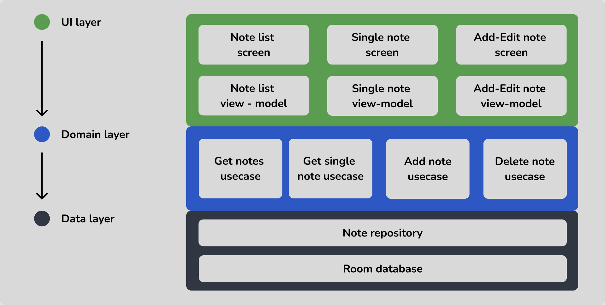

# Notepad-Android-App
A complete Android Notepad Application project created by following clean architecture design pattern, Also with **Kotlin** + **MVVM** + **Hilt** + **Room database** + **Coroutine** + **Flow** + **Jetpack compose** + etc. Managed the **CI/CD** pipeline with GitHub Actions.

## Functional requirements
- Create note
- Edit note
- Delete note
- Show single note in one screen
- Show all the notes in a list (with last edited item in the top)

## Basic UI design

## App Architecture

## Commits
- [Initial commit](https://github.com/gobinda1547/Notepad-Android-App/commit/bfecc293e4c746bd6c924a63cfe6f4c8231051a5)
- [Uploading brand new project created by Android studio](https://github.com/gobinda1547/Notepad-Android-App/commit/df91b138b1121683c4bbbf169cd33a1b6941dfa6)
- [Completing data layer implementation](https://github.com/gobinda1547/Notepad-Android-App/commit/2e4ef31286352806c6a8b018e7c81621df1383e4)
- [Completing domain layer implementation](https://github.com/gobinda1547/Notepad-Android-App/commit/1e55fe2400e29b003caa6bb2c4ff906fc3d78f0e)
- [Added hilt into the project & provide all the implementation details to hilt for dependency injection](https://github.com/gobinda1547/Notepad-Android-App/commit/f450d3871371cf5e8082f9cad5f0ab8644426b62)
- [Completed implementation of note list screen (requirement #5)](https://github.com/gobinda1547/Notepad-Android-App/commit/5930780d384f21e8eebf95257c66ebeeeac5b585)
- [Completed implementation of add note screen](https://github.com/gobinda1547/Notepad-Android-App/commit/eedc5b417f417f9de349a9b14c4c23d246ff92b3)
- [Adding transition animation in all composable screens](https://github.com/gobinda1547/Notepad-Android-App/commit/ed35901c9243aeb87415215e23d89232a9bccc9e)
- [Completed implementation of show single note screen](https://github.com/gobinda1547/Notepad-Android-App/commit/14c5275937fdafeae7cbbb05a75f3da00e939164)
- [Showing Add-Edit screen title based on condition](https://github.com/gobinda1547/Notepad-Android-App/commit/ab671a1a5d526e2f563ec1946694ee291b93160b)
- [Making all the composable screens scrollable](https://github.com/gobinda1547/Notepad-Android-App/commit/a99450e663fe9c519d89e8b8e14c6cfeeda62ca7)
- [Added a divider between note title & note content to represent different input field](https://github.com/gobinda1547/Notepad-Android-App/commit/944fcea500502a1f6b57f53fa6244eb4681f3b11)
- [Keeping only the dark color scheme & removing others](https://github.com/gobinda1547/Notepad-Android-App/commit/5da72d71be5932393163149dfd6e43e9c4dd6f60)
- [Showing the last edited note in the top of the list](https://github.com/gobinda1547/Notepad-Android-App/commit/6c1f997bb7dbc2021296c0cdbad1ba579bbc1144)
- [Delete dialog implementation done](https://github.com/gobinda1547/Notepad-Android-App/commit/db53d44b97ebc2890d5bec242f6bafe4d0a9064f)
- [Managing CI via github actions](https://github.com/gobinda1547/Notepad-Android-App/commit/ff7e71b3e37d76022a1a94497c5de1c3b90a8e97)

## How to get the APK
- Pull the project (master branch)
- Open Android studio & import the project
- Sync project file & wait for build to finish
- Now generate DEBUG or RELEASE apk as your need.